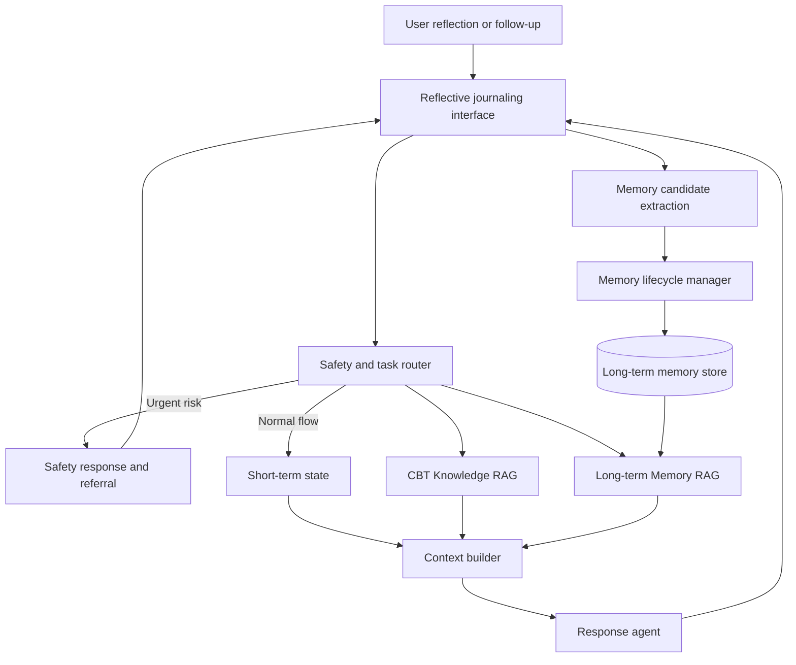

Research prototype for **A Hierarchical Memory Framework for Psychotherapy Reflection and Care Tracking**.

## Project overview

This project investigates how a CBT reflective-journaling agent can form, store, retrieve, update, correct and forget memories across repeated sessions. It is designed as a research and educational prototype, not as a diagnostic tool or a replacement for therapists.

The central research question is:

> How can an AI agent use short-term and long-term memory to maintain continuity, track CBT goals and assignments, respect user corrections, and remain safe across multiple sessions?

## Overall architecture



The system uses two separate but coordinated retrieval channels:

- **CBT Knowledge RAG** retrieves professional CBT evidence, methods and safety guidance.
- **Long-term Memory RAG** retrieves relevant user-specific history, including emotions, goals, events, assignments, outcomes, cognitive patterns and corrections.

Deterministic safety routing runs before both retrieval channels. Qualified knowledge and memory results are combined with the short-term session state by the context builder. Either retriever may return no context when its results are not sufficiently relevant.

The conversation also has a separate memory write path: supported information is extracted as a candidate, validated, versioned and managed through update, correction and forgetting rules before it becomes retrievable.

## Architecture components

| Component | Responsibility |
|---|---|
| Safety and task router | Detects urgent risk and decides whether knowledge or memory retrieval is required |
| Short-term memory | Maintains the recent conversation, current emotion, active goal, thought record and assignment |
| CBT Knowledge RAG | Retrieves grounded professional evidence and safety references |
| Long-term Memory RAG | Stores and retrieves user-specific, time-sensitive and correctable memories |
| Memory lifecycle manager | Handles consolidation, conflict, correction, superseding, expiry and deletion |
| Context builder | Validates, separates and budgets short-term state, personal memory and professional evidence |
| Response agent | Generates a supportive response while respecting safety and role boundaries |

See the [complete architecture diagram set](docs/diagrams/README.md) for detailed diagrams of each component.

## Repository structure

```text
cbt-memory-system/
├── docs/
│   ├── architecture.md
│   └── diagrams/                       # Overall and module-level diagrams
├── modules/
│   ├── cbt-knowledge-rag/              # Professional knowledge and safety references
│   ├── long-term-memory/
│   │   ├── schema/                     # Typed memory records and metadata
│   │   ├── extraction/                 # Session-to-memory candidates
│   │   ├── storage/                    # User-scoped records and indexes
│   │   ├── retrieval/                  # Query, search, reranking and gating
│   │   └── lifecycle/                  # Update, correction, conflict and forgetting
│   └── agent-integration/              # Routing and context assembly
├── evaluation/
│   ├── knowledge-retrieval/
│   ├── memory-retrieval/
│   ├── end-to-end-dialogue/
│   └── safety/
└── app/                                # Journal, assignments and memory controls
```

## Experimental design

The main comparison will include:

1. no cross-session memory;
2. short-term memory only;
3. short-term plus manageable long-term memory.

The response model, CBT Knowledge RAG, safety rules and evaluation scenarios will remain fixed across these conditions so that differences can be attributed to the memory framework.

## Current status

The CBT Knowledge RAG module is complete. It includes PDF cleaning, page-aware chunks, BM25, multilingual E5 dense retrieval, hybrid fusion, cross-encoder reranking, bilingual safety routing and a 50-question retrieval evaluation.

Current retrieval results:

| Metric | Result |
|---|---:|
| Recall@5 | **0.80** |
| Recall@10 | **0.84** |
| MRR@10 | **0.583** |
| Safety Recall@5 | **1.00** |

Response pilots suggest that knowledge RAG improves grounding and traceability, particularly for professional boundaries and safety references, but has not yet demonstrated a general improvement in dialogue quality. The next iteration will add relevance gating and allow zero retrieved chunks.

## Four-week implementation plan

| Week | Main goal | Key tasks | Deliverables |
|---|---|---|---|
| **Week 1** | Memory schema and data preparation | Define short- and long-term memory types; design schemas for emotions, events, goals, assignments, cognitive patterns and corrections; prepare multi-session test cases | Memory Schema v1, structured examples and a memory-extraction test set |
| **Week 2** | Memory writing and lifecycle management | Implement candidate extraction, validation, deduplication, conflict detection, updating, user correction, expiry and forgetting | Memory Manager v1, correction workflow and unit-test results |
| **Week 3** | Long-term Memory RAG and Agent integration | Build user-scoped memory indexes; implement semantic retrieval, temporal reranking and relevance gating; integrate both RAG channels with short-term context | Long-term Memory RAG v1, dual-retrieval pipeline and an end-to-end prototype |
| **Week 4** | Comparative evaluation and reporting | Compare the three memory conditions; evaluate continuity, latest-state accuracy, assignment tracking, correction, safety, latency and token cost | Evaluation results, error analysis, system demo and progress report |

## Documentation

- [System architecture](docs/architecture.md)
- [Architecture diagram set](docs/diagrams/README.md)
- [CBT Knowledge RAG report](modules/cbt-knowledge-rag/CBT_RAG_v1_Report.md)
- [Expanded dialogue evaluation](modules/cbt-knowledge-rag/CBT_RAG_v3_Expanded_Evaluation.md)
