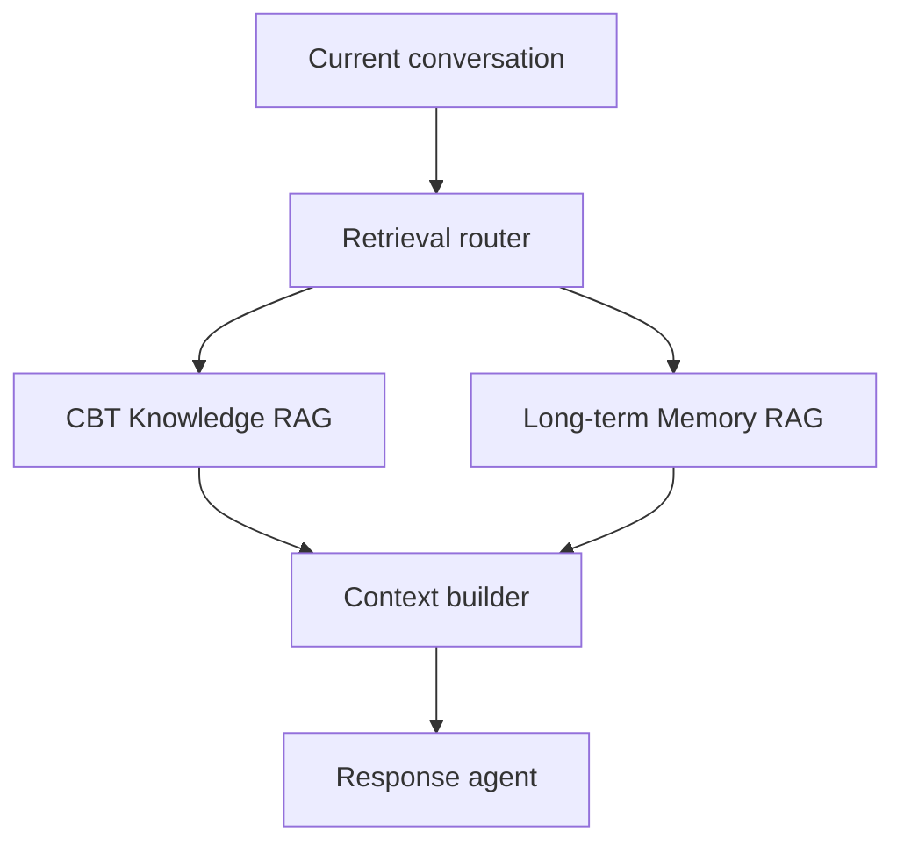

# CBT Memory System

Research prototype for **A Hierarchical Memory Framework for Psychotherapy Reflection and Care Tracking**.

## Research focus

This project studies how a long-term CBT reflective journaling agent should form, store, retrieve, update, correct and forget memories across repeated sessions. It is not intended to diagnose users or replace therapists.

The system uses two separate but coordinated retrieval channels:

1. **CBT Knowledge RAG** retrieves professional CBT guidance, evidence and safety boundaries.
2. **Long-term Memory RAG** retrieves user-specific goals, emotions, events, patterns, assignments, outcomes and corrections.

The response agent combines qualified results from both channels with the current short-term conversation. Either retriever may return no context.

The principal memory comparison remains:

1. no cross-session memory;
2. short-term memory only;
3. short-term memory plus manageable long-term memory.

The response model, CBT Knowledge RAG and deterministic safety rules must be frozen across these memory conditions.

## Repository structure

```text
cbt-memory-system/
├── docs/                              # Architecture and research decisions
├── modules/
│   ├── cbt-knowledge-rag/             # Professional knowledge and safety references
│   ├── long-term-memory/
│   │   ├── schema/                    # Typed memory records and metadata
│   │   ├── extraction/                # Session-to-memory candidates
│   │   ├── storage/                   # User-scoped records and indexes
│   │   ├── retrieval/                 # Query, search, reranking and gating
│   │   └── lifecycle/                 # Update, correction, conflict and forgetting
│   └── agent-integration/             # Routing and context assembly
├── evaluation/
│   ├── knowledge-retrieval/
│   ├── memory-retrieval/
│   ├── end-to-end-dialogue/
│   └── safety/
└── app/                               # Journal, assignments and memory controls
```

## Retrieval and response flow



## Current status

Week 1 is complete: the CBT knowledge module implements PDF cleaning, cited chunks, BM25, multilingual E5 dense retrieval, hybrid fusion, cross-encoder reranking, bilingual safety routing and a 50-question evaluation.

Final cleaned retrieval result: Recall@5 **0.80**, Recall@10 **0.84**, MRR@10 **0.583**, and safety Recall@5 **1.00**.

The response pilots show that RAG improves grounding and traceability, especially for professional boundaries and safety references, but has not yet demonstrated a general dialogue-quality improvement. The next knowledge-RAG iteration will add relevance gating and allow zero retrieved chunks.

See [the CBT RAG report](modules/cbt-knowledge-rag/CBT_RAG_v1_Report.md) and [the system architecture](docs/architecture.md).
