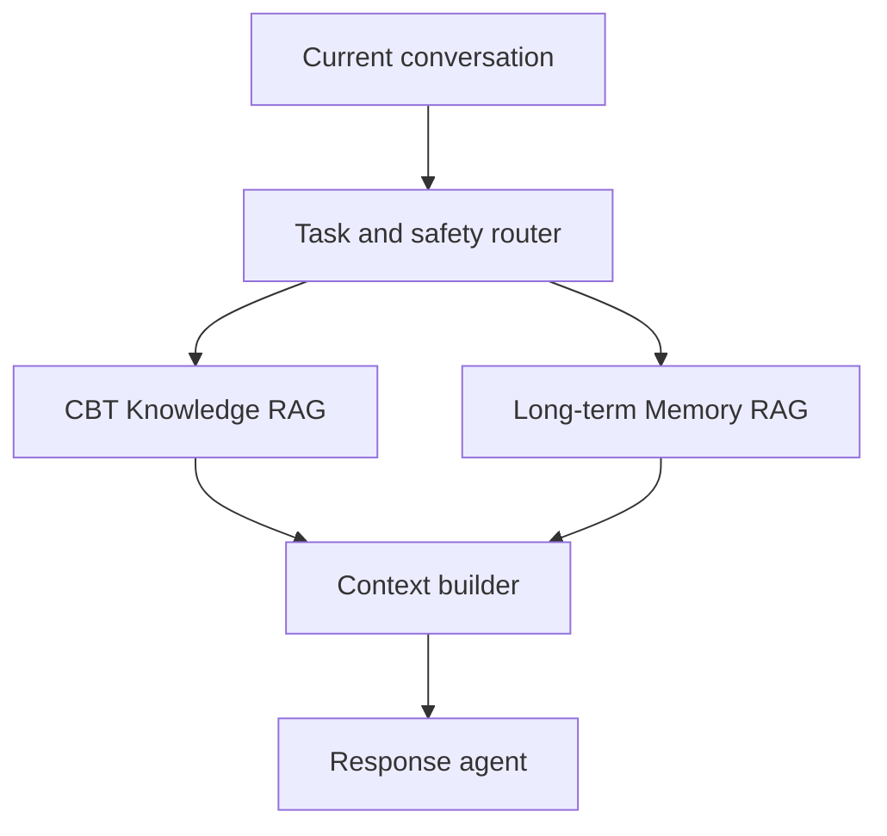

# System architecture

The system uses two independently governed retrieval channels:

- **CBT Knowledge RAG** for professional methods, evidence and safety references;
- **Long-term Memory RAG** for user-specific history, goals, assignments, patterns and corrections.

They share an orchestration layer but use different stores, metadata, ranking features and evaluation criteria.



## Context layers

The response context is assembled from independently governed inputs:

1. recent conversation and current session summary;
2. active assignment and goal state;
3. selected, valid long-term memories;
4. selected CBT knowledge evidence;
5. deterministic safety-policy output.

Either retriever may return zero items. Retrieved text is evidence, not an instruction to override the current conversation.

## CBT Knowledge RAG

This channel retrieves relatively stable professional material. Ranking considers semantic relevance, source authority, CBT topic and safety labels. Relevance gating should prevent weak evidence from entering the prompt. Chinese conversations and English sources require multilingual retrieval and reranking.

## Long-term Memory RAG

This channel retrieves dynamic, user-scoped memory. It includes a write path and a read path.

### Write path

```text
session
→ candidate extraction
→ validation and sensitivity check
→ deduplication/conflict check
→ structured record and embedding
```

### Read path

```text
current task
→ memory query
→ user/lifecycle/sensitivity filters
→ candidate retrieval
→ temporal and semantic reranking
→ relevance gate
→ context builder
```

Memory ranking may consider:

- semantic and task relevance;
- time and latest-state validity;
- importance;
- confidence;
- user confirmation;
- active or superseded lifecycle state;
- sensitivity and access permission.

Every memory retains provenance, timestamps, confidence, lifecycle status and user-confirmation state. Explicit user facts and model inferences remain distinguishable.

## Lifecycle rules

The memory system must:

- consolidate duplicates without erasing provenance;
- resolve conflicts by preserving history;
- prefer confirmed and newer information where appropriate;
- mark replaced memories as superseded;
- support expiry or importance decay;
- support user inspection, correction and deletion;
- prevent deleted or superseded records from retrieval.

## Safety boundary

Deterministic crisis routing runs before both retrieval channels. CBT Knowledge RAG can provide grounded safety references, but it does not decide whether a crisis exists. Sensitive memories require separate access controls and must not be retrieved only because they are semantically similar.

## Experimental control

For the main memory study, the response model, CBT Knowledge RAG, safety rules and dialogue scenarios remain frozen across all memory conditions. The independent variable is the availability and management of cross-session memory.
