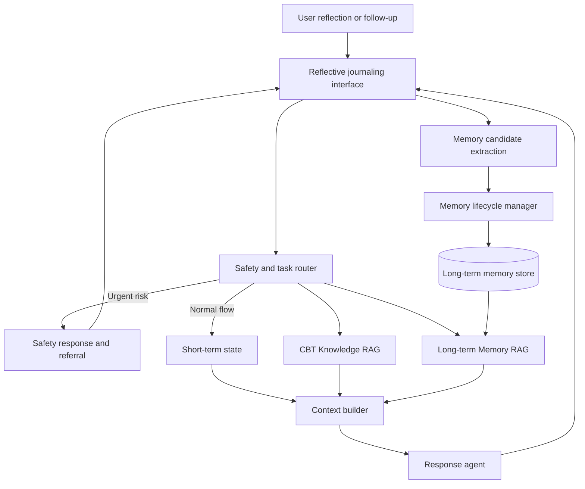
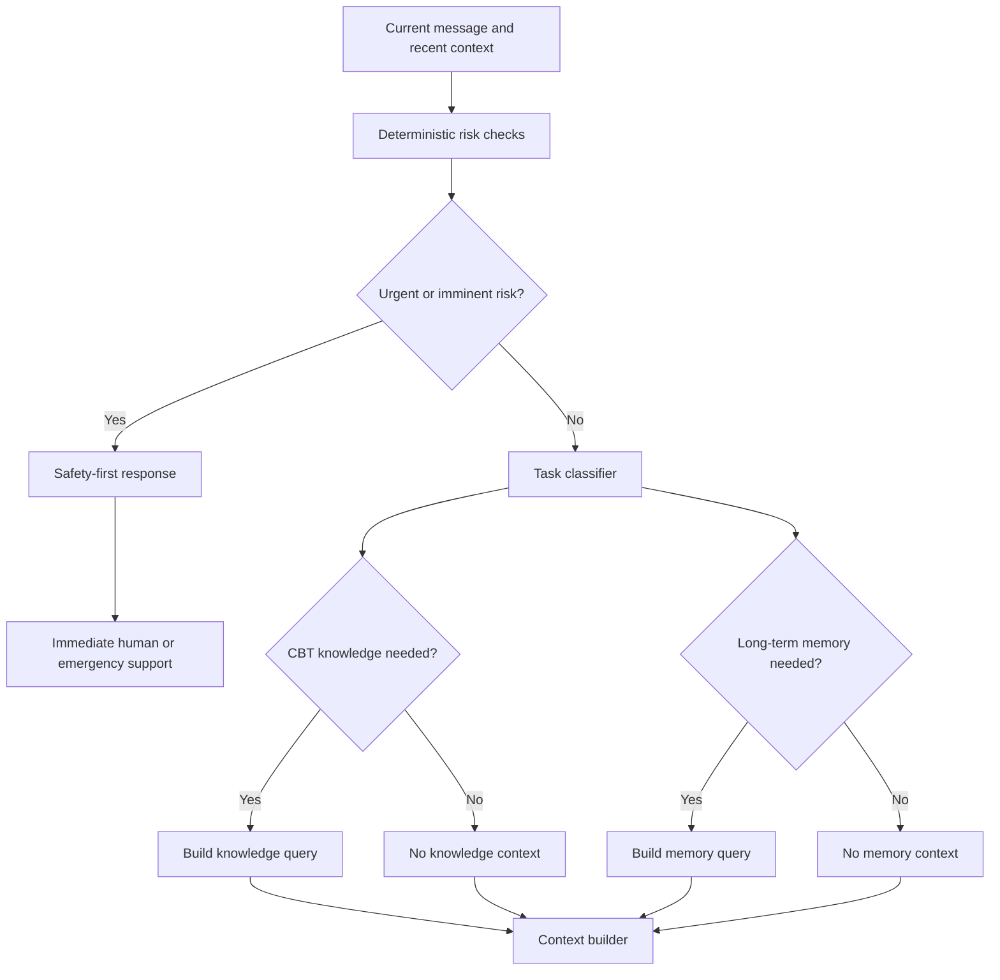
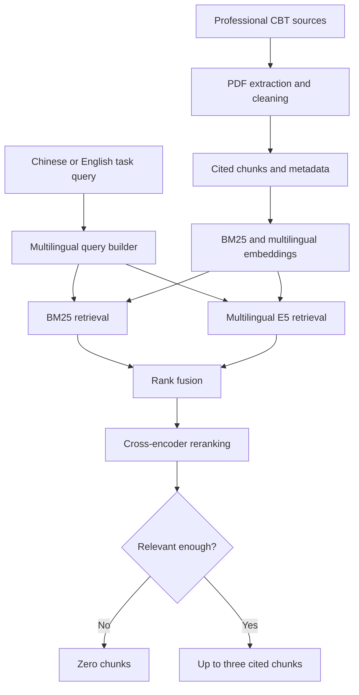
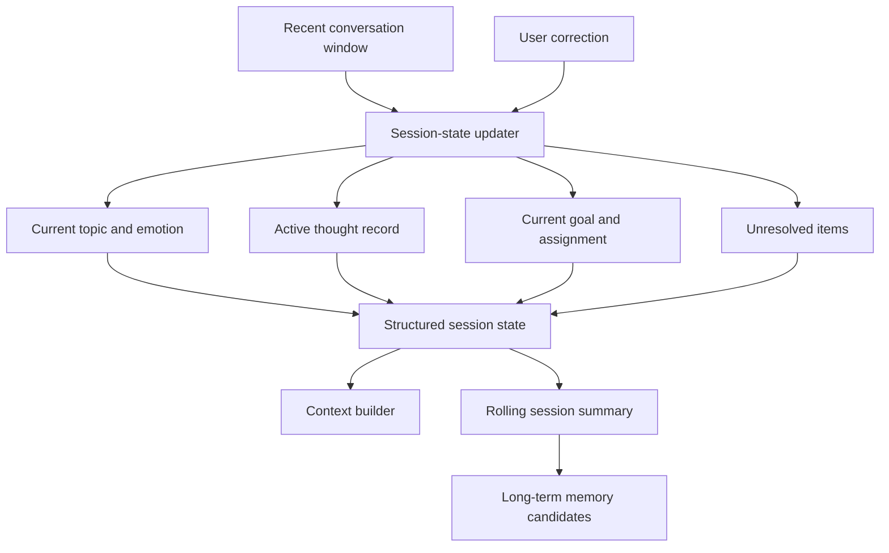
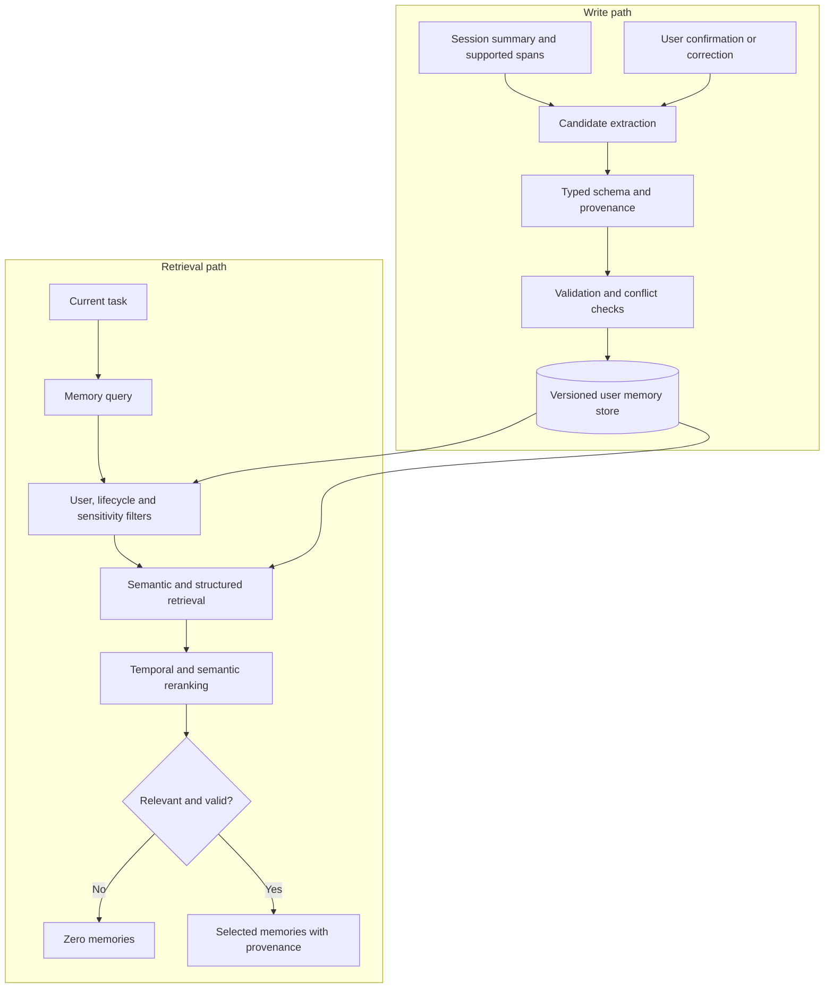
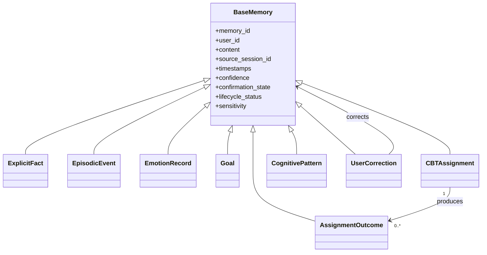
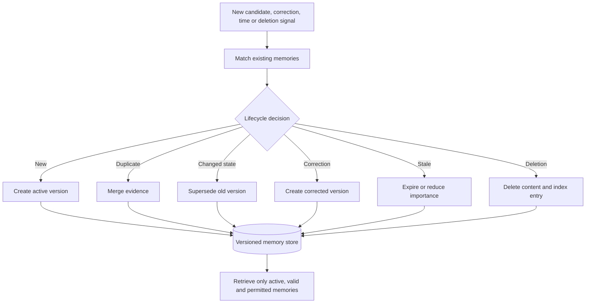
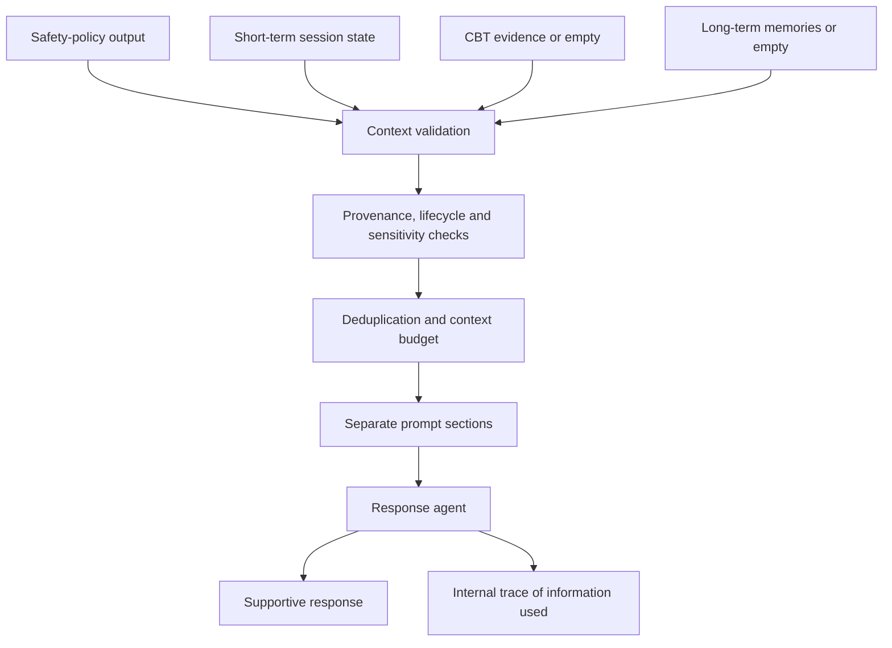
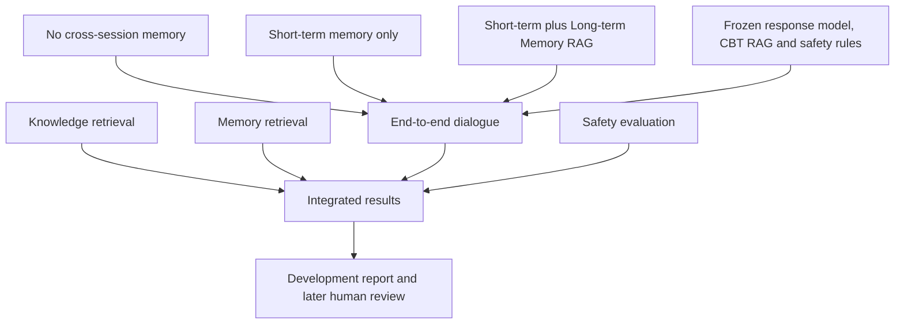

# System architecture

[Back to project overview](../README.md)

This page contains the overall architecture and all module-level diagrams in one continuous document.

## 1. Overall system

The system combines current-session state with two independent retrieval channels. Safety routing is executed before normal retrieval.

## 2. Safety and task routing

Crisis detection is not delegated to vector retrieval. Either normal retrieval channel may return no context.

## 3. CBT Knowledge RAG

This channel provides professional evidence, role boundaries and safety references.

## 4. Short-term memory

Short-term memory represents what is active now. Only selected, supported information becomes a long-term memory candidate.

## 5. Long-term Memory RAG

The write path creates traceable, correctable memories. The read path retrieves only relevant, valid and permitted memories.

## 6. Memory schema

Every memory retains provenance, time, confidence, confirmation, lifecycle and sensitivity metadata. User statements remain distinguishable from model inferences.

## 7. Memory lifecycle

Updates preserve provenance. Superseded, expired, deleted or restricted memories are excluded from normal retrieval.

## 8. Agent context assembly

Professional evidence and personal memory remain separate in the prompt and cannot silently override the current user message.

## 9. Evaluation framework

The main experiment changes only cross-session memory. Knowledge RAG, the response model, safety rules and scenarios remain fixed.
