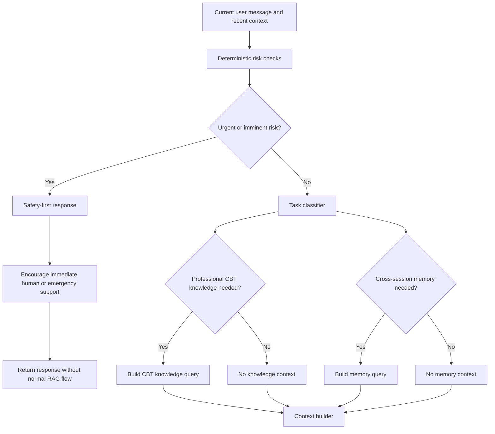

# Safety and task routing

**Input:** current message, recent turns and deterministic safety signals.  
**Output:** a safety-first response or separate retrieval decisions for professional knowledge and long-term memory.

Safety detection is not delegated to similarity search. RAG may supply grounded safety guidance, but it does not decide whether a crisis exists.
