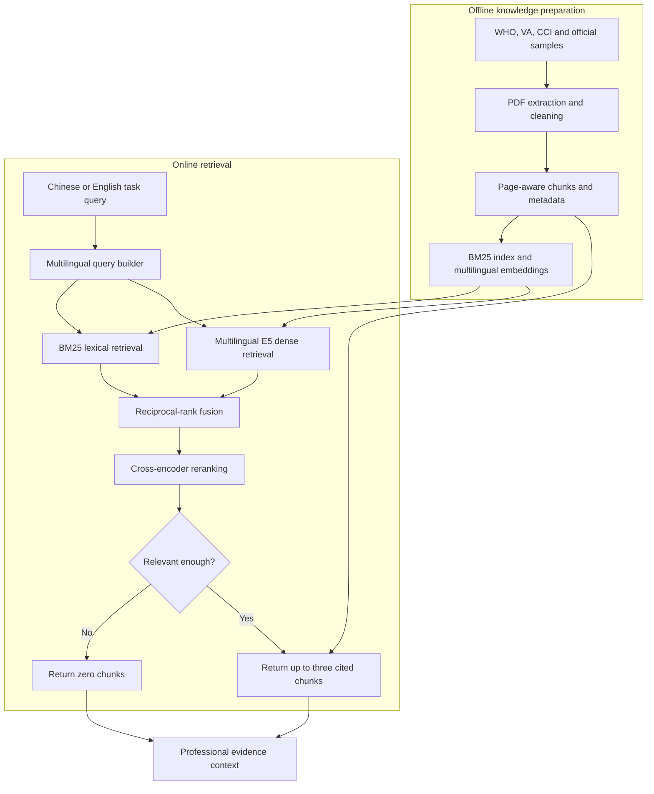

# CBT Knowledge RAG

**Input:** a task-focused retrieval query.  
**Output:** zero to three relevant, cited CBT evidence chunks.

This module supports professional grounding, role boundaries and safety references. It remains fixed across the main memory-system comparison.
