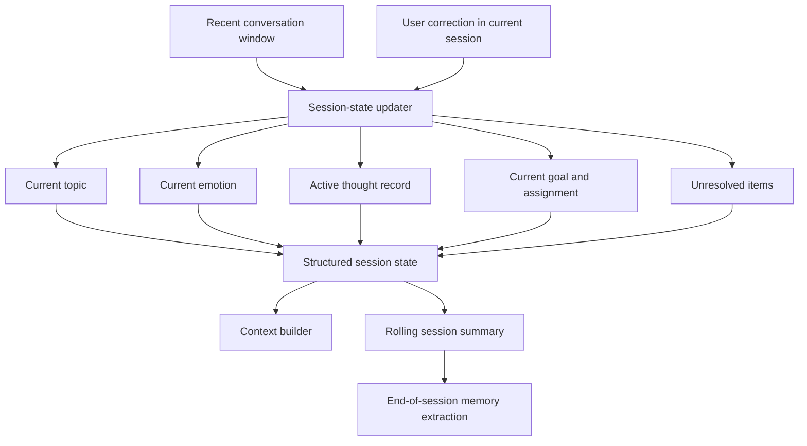

# Short-term memory

**Input:** recent turns and current-session corrections.  
**Output:** a compact, structured representation of what is active now.

Short-term memory is session-scoped. Only selected information becomes a candidate for long-term storage.
