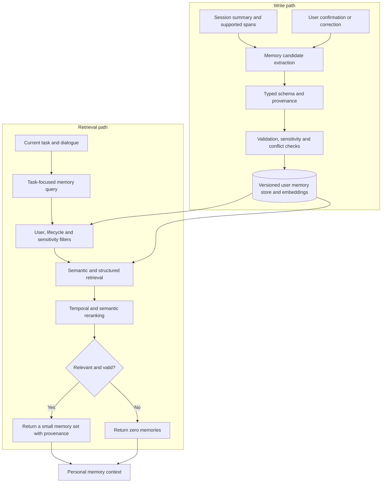

# Long-term Memory RAG

**Write path:** creates structured, traceable and correctable memories.  
**Read path:** retrieves only memories that are relevant, valid and permitted for the current task.

Memory ranking considers semantic relevance, recency, importance, confidence, user confirmation and lifecycle status.
