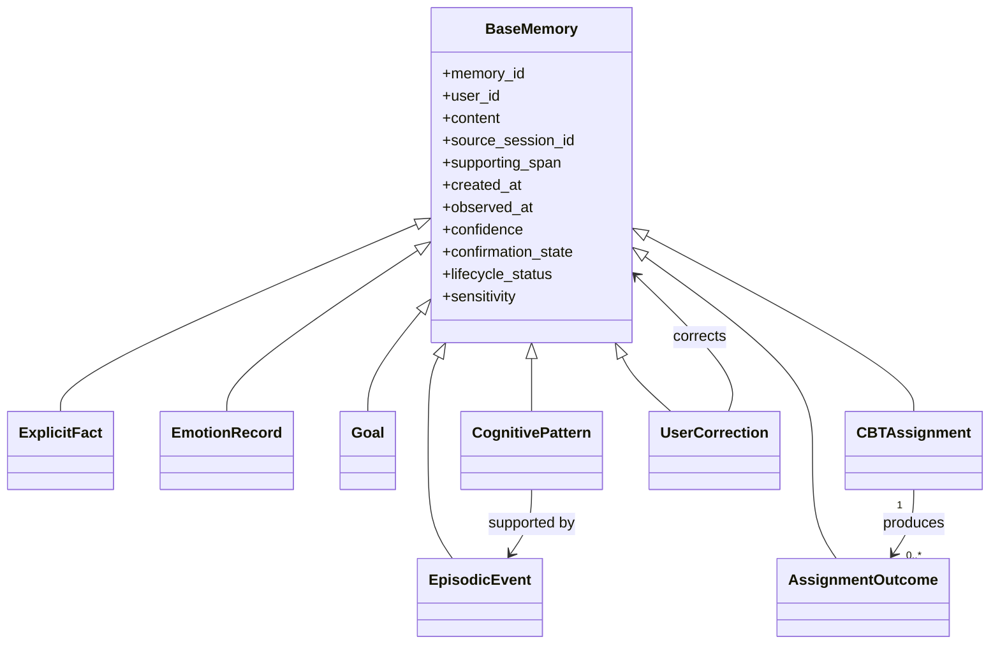

# Memory schema

Every memory carries provenance, time, confidence, confirmation, lifecycle and sensitivity metadata. Explicit user statements remain distinguishable from model-generated inferences.
