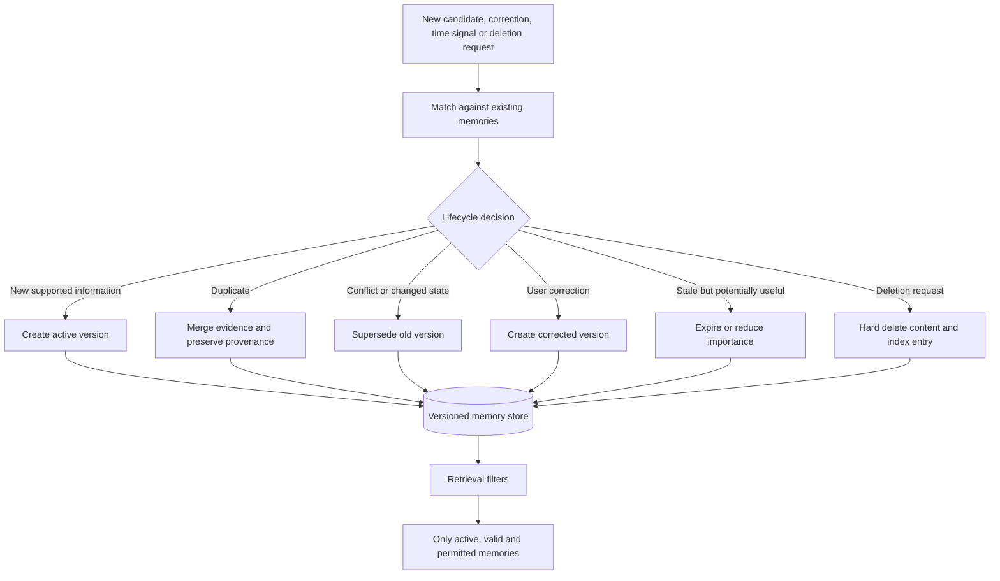

# Memory lifecycle

The system preserves history for updates and conflicts, but deleted content must be removed. Superseded, expired or restricted memories cannot enter the response context unless an explicit policy allows them.
