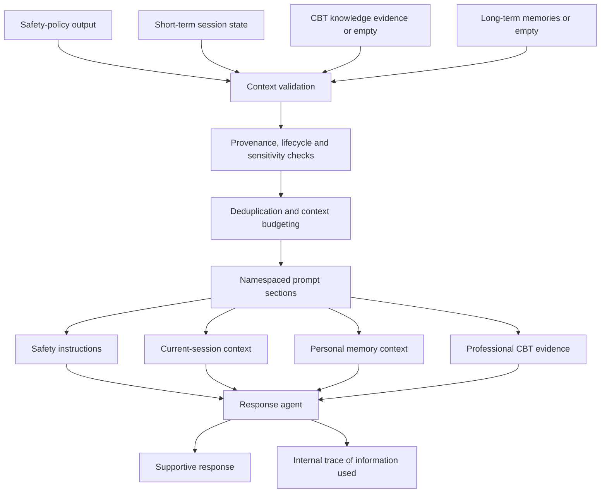

# Agent context assembly

The two RAG outputs remain separate in the prompt. Personal memories are not presented as professional evidence, and retrieved evidence is not allowed to override the current user message.
