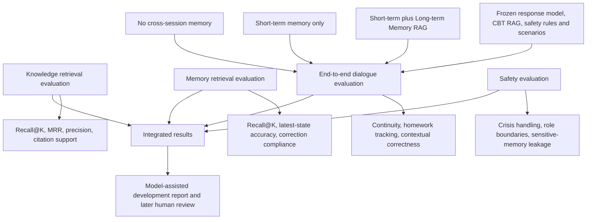

# Evaluation framework

The main experiment changes only cross-session memory availability and management. Knowledge RAG, the response model, safety rules and scenarios remain fixed so that differences can be attributed to the memory framework.
