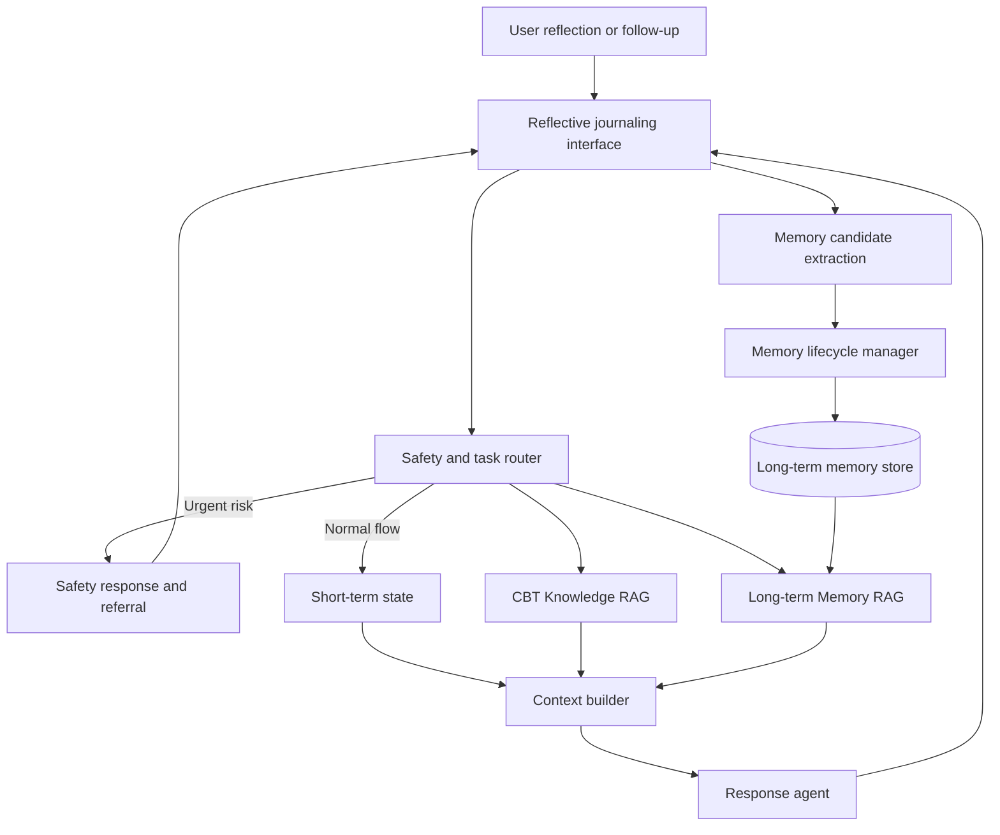

# Architecture diagram set

These diagrams present the CBT Memory System at two levels: one overall system view followed by detailed views of each major block. Diagram labels are in English for presentation and supervisor review.

## Diagram index

1. [Safety and task routing](01-safety-task-routing.md)
2. [CBT Knowledge RAG](02-cbt-knowledge-rag.md)
3. [Short-term memory](03-short-term-memory.md)
4. [Long-term Memory RAG](04-long-term-memory-rag.md)
5. [Memory schema](05-memory-schema.md)
6. [Memory lifecycle](06-memory-lifecycle.md)
7. [Agent context assembly](07-agent-context-assembly.md)
8. [Evaluation framework](08-evaluation-framework.md)

## Overall architecture

### Core idea

The system has two retrieval channels. CBT Knowledge RAG retrieves professional evidence and safety guidance, while Long-term Memory RAG retrieves relevant user-specific history. Deterministic safety routing runs before both. The response agent receives only qualified context, and the conversation can also create or update long-term memories through a separate write path.
